# Naga

<p align="center">
  
</p>

<p>
  <a href="LICENSE"></a>
  
  
  
  
  <a href="https://www.repostatus.org/#active"></a>
</p>

> **An @enchanter-ai product — algorithm-driven, agent-managed, self-learning.**

Observes an existing artifact's structural and stylistic fingerprint and generates new artifacts that match the observed shape, vocabulary, and naming idiom. Source-as-spec replication — orthogonal to from-scratch prompt engineering (Wixie) and codebase mapping (Gorgon).

**6 sub-plugins. 5 engines. 3 agents. 5 slash commands. Single PreCompact hook by design (skill-invoked, like Wixie). One install.**

> Developer runs `/naga:observe ../enchanter-foundations/packages/core/conduct/discipline.md`. **naga-fingerprinter** extracts the AST/Markdown shape vector via **N1 Zhang-Shasha** (148 nodes), the TF-IDF token signature via **N2 Spärck Jones** (84 distinct stems), and the heading/identifier naming convention via **N3 Levenshtein** (kebab-case, 4-level nesting). Fingerprint hash `a3f2…` persists to `state/patterns/`. Developer then runs `/naga:match ../enchanter-foundations/packages/core/conduct/discipline.md shared/conduct/security.md` to scaffold a new sibling module. **naga-shaper** generates chunk-by-chunk, scoring each via **N4 Salton-Wong-Yang cosine** against the fingerprint; chunks below the per-(`claude-md`, current target) **N5** posterior threshold trigger rewrite. Final fidelity: `0.87 (CI 0.82–0.92, N=232)` — clears the 0.78 threshold. `/compact` fires later — **naga-learning** updates the `(claude-md × claude-md)` posterior to tighten next-time's threshold.
>
> Time: deterministic fingerprint, bounded generation loop. Developer effort: invoke one slash command.

## TL;DR

**In plain English:** "Match the style of this file" is a coin flip. The AI averages your example against the entire internet and ships almost-right. Naga makes it actually match — and proves it with a score.

**Technically:** N1 Zhang-Shasha tree edit distance extracts the postorder AST shape signature from the source artifact; N2 Spaerck Jones TF-IDF captures the identifier/comment/structure token fingerprint; both are stored atomically in `state/patterns/<hash>.json`. N4 Salton-Wong-Yang cosine fidelity is scored per generated chunk against the fingerprint, and chunks below the per-(pattern-class × target-domain) N5 Gauss posterior threshold are rewritten once then dropped — validated output ships with `(score, ci_low, ci_high, N)` from a bootstrap 95% CI.

---

## Origin

**Naga** takes its name from **Twilight Forest** — the verdant serpent boss whose long coiled body shifts to match the
hedge-maze terrain of its lair. Scale-pattern, segment-length, and
turn-radius all conform to the surrounding shape. That is literally the
function of this plugin: observe a source artifact's shape, vocabulary, and
naming idiom, and generate new artifacts whose form follows that observed
environment, segment by segment, until the fidelity score clears the
per-class threshold.

The question this plugin answers: *Make something new that looks like this existing thing.*

## Who this is for

- Developers propagating idioms across sibling modules — when `../enchanter-foundations/packages/core/conduct/discipline.md` is the gold standard and the next five conduct modules must match its shape, vocabulary, and naming convention exactly.
- Teams scaffolding from existing artifacts instead of from a template repo: point Naga at the real source at invocation time; no separate template to maintain or drift.
- Anyone who has heard "it's almost right" from a reviewer — that phrase diagnoses single-axis replication (correct structure, alien naming, or vice versa); Naga requires N1 + N2 + N3 to jointly clear the N4 fidelity threshold.

Not for:

- Prompt engineering from scratch. Naga replicates an observed shape; Wixie engineers a new shape from a technique catalog. "Make me a B2B ticket router prompt" is Wixie. "Make this new conduct module look like `discipline.md`" is Naga.
- Continuous background scanning. Naga is skill-invoked by design — pattern replication is a deliberate developer request, not an ambient signal.

## Contents

- [How It Works](#how-it-works)
- [What Makes Naga Different](#what-makes-naga-different)
- [The Full Lifecycle](#the-full-lifecycle)
- [Install](#install)
- [Quickstart](#quickstart)
- [7 Plugins, 3 Agents](#7-plugins-3-agents)
- [The Science Behind Naga](#the-science-behind-naga)
- [vs Everything Else](#vs-everything-else)
- [Agent Conduct (13 Modules)](#agent-conduct-13-modules)
- [Architecture](#architecture)
- [License](#license)

## How It Works

On `/naga:observe <source>`, **naga-observe** parses the source artifact via

<p align="center">
  <a href="docs/assets/pipeline.mmd" title="View pipeline source (Mermaid)">
    
  </a>
</p>

<sub align="center">

Source: [docs/assets/pipeline.mmd](docs/assets/pipeline.mmd) · Regeneration command in [docs/assets/README.md](docs/assets/README.md).

</sub>

stdlib `ast`, runs **N1 Zhang-Shasha tree edit distance** against an empty
AST to derive the postorder shape signature, runs **N2 Spaerck Jones TF-IDF**
over identifier/comment/structure tokens, and persists the resulting
fingerprint atomically to `plugins/naga-observe/state/patterns/<hash>.json`.

On `/naga:match <source> <target>`, **naga-shift** loads the fingerprint,
reads the per-(pattern-class x target-domain) p10 threshold from the N5
posterior, and dispatches the **naga-shaper** Sonnet agent to emit chunk-by-
chunk. Each chunk is scored via **N4 Salton-Wong-Yang cosine** against the
source vector; chunks below threshold are rewritten once, then dropped.

On `/naga:validate <new> <source>`, **naga-validate** re-scores cold via
N1 + N4 and reports `(score, ci_low, ci_high, N)` with bootstrap 95% CI.

On `PreCompact`, **naga-learning** folds new fidelity observations into the
per-(pattern-class x target-domain) posterior via **N5 Gauss Accumulation**.
This is the single hook binding in Naga.

## What Makes Naga Different

### The source is the spec — no template repo required

Cookiecutter, Yeoman, and plopjs hardcode patterns at template-author time. The user maintains a separate template repo that drifts from the actual source; adding a new convention means editing the template, not pointing at a new example. Naga has no template authoring step. `/naga:match source target` — the source path passed at invocation time IS the spec.

### Fingerprint is multi-axis and multi-file by construction

GitHub Copilot "complete in similar style" operates on a single-file, single-cursor context. Cross-file structural patterns — naming conventions, error-handling idioms, blank-line conventions — break across modules because Copilot never read the second file. Naga's N1 Zhang-Shasha tree edit distance compares ASTs across the **whole source artifact set**; N2 TF-IDF spans identifier, comment, and structure tokens; N3 Levenshtein pins naming-convention strings. All three must jointly contribute before N4 cosine fidelity clears the threshold.

### Generation operates inside a hard structural constraint, not against a prior

Raw "few-shot from these examples" prompting relies on the LLM's prior. The model averages examples against its training distribution and emits something closer to its prior than to the examples; subtle source-specific conventions (a project's preference for `_internal` prefix) are washed out. Naga computes the fingerprint **deterministically** (N1 + N2 + N3) and passes it as a structural constraint to the naga-shaper Sonnet agent. The shaper generates inside that constraint, not against its prior.

### Drift is measured per chunk, not assumed absent

Cursor and Aider mid-session refactors start matching the source, encounter a token where their prior is strong, switch to their prior, and never recover. Output is half-source, half-prior. Naga computes the **N4 cosine fidelity score per chunk during generation**; chunks that fall below the per-(pattern-class, target-domain) N5 posterior threshold trigger a rewrite. "Almost right" is rejected, not shipped.

### Honest numbers, or no numbers

Every `/naga:validate` row and every `naga.fidelity.measured` event carries `(score, ci_low, ci_high, N)` from a non-parametric bootstrap. Missing N → the row is rejected by the Haiku validator gate, never emitted with an invented confidence band.

## The Full Lifecycle

Naga is **skill-invoked by design** — 1 hook (PreCompact persistence) + 5 skill commands. No phase runs continuously in the background.

<p align="center">
  <a href="docs/assets/lifecycle.mmd" title="View lifecycle source (Mermaid)">
    .json fingerprint and target output; single PreCompact hook fires naga-learning to update N5 per-(pattern-class × target-domain) Gauss posterior, refining next-session per-class thresholds"
         width="100%" style="max-width: 1100px;">
  </a>
</p>

<sub align="center">

Source: [docs/assets/lifecycle.mmd](docs/assets/lifecycle.mmd) · Regeneration command in [docs/assets/README.md](docs/assets/README.md).

</sub>


| Phase | Event or Skill | Sub-plugin | Engines | Output |
|-------|----------------|------------|---------|--------|
| Observe | `/naga:observe <source>` | `naga-observe` | N1 + N2 | `state/patterns/<hash>.json`; `naga.pattern.fingerprinted` |
| Fingerprint (read-only) | `/naga:fingerprint <source>` | `naga-fingerprint` | N2 + N3 | N2 + N3 report; no state writes |
| Generate | `/naga:match <source> <target>` | `naga-shift` | N1 + N2 + N3 + N4 + N5 gate | generated artifact; `naga.artifact.generated` |
| Validate | `/naga:validate <new> <source>` | `naga-validate` | N1 + N4 | fidelity score with bootstrap CI; `naga.fidelity.measured` |
| Cross-repo | `/naga:match-across <src-repo> <tgt-repo>` | `naga-cross-repo` | N1 + N2 + N3 + N4 | generated artifact; Opus escalation on domain mismatch |
| Learn | PreCompact | `naga-learning` | N5 | `state/posterior.json`, `state/learnings.jsonl` |

The PreCompact hook is the single hook binding in Naga and is intentional — do not add SessionStart, PostToolUse, or UserPromptSubmit bindings.

## Install

```
/plugin marketplace add enchanter-ai/naga
/plugin install full@naga
```

Or cherry-pick: `/plugin install naga-fingerprint@naga`.

## Quickstart

```
/plugin install full@naga
/naga:observe ../enchanter-foundations/packages/core/conduct/discipline.md
/naga:match  ../enchanter-foundations/packages/core/conduct/discipline.md  shared/conduct/discipline-mirror.md
```

Expected: a fingerprint JSON, then a generated mirror artifact with
`(score, ci_low, ci_high, N)` printed and persisted.

## 7 Plugins, 3 Agents

| Plugin              | Trigger                            | Engines       | Agent (tier)                 |
|---------------------|------------------------------------|---------------|------------------------------|
| naga-observe        | /naga:observe                      | N1, N2        | naga-fingerprinter (Haiku)   |
| naga-shift          | /naga:match                        | N1, N2, N3, N4| naga-shaper (Sonnet) + naga-orchestrator (Opus, on escalation) |
| naga-validate       | /naga:validate                     | N1, N4        | naga-fingerprinter (Haiku)   |
| naga-cross-repo     | /naga:match-across                 | N1, N2, N3, N4| naga-shaper (Sonnet) + naga-orchestrator (Opus) |
| naga-fingerprint    | /naga:fingerprint                  | N2, N3        | naga-fingerprinter (Haiku)   |
| naga-learning       | PreCompact                         | N5            | (none — pure compute)        |
| full                | meta                               | —             | —                            |

**Why one hook?** Naga is skill-invoked by design like Wixie. Pattern
replication is a deliberate request, not a continuous background signal.
The single PreCompact hook persists the cross-session posterior; every other
sub-plugin fires from a slash command. Do NOT add SessionStart, PostToolUse,
or UserPromptSubmit bindings — the 1-hook count is intentional.

## What You Get Per Match

Every `/naga:observe` extracts a fingerprint and persists it; every `/naga:match` generates a target artifact under per-chunk N4 fidelity gating; every `PreCompact` folds the per-(pattern-class × target-domain) fidelity envelope into the cross-session posterior. All writes go through the atomic `shared/scripts/state_io.atomic_write_json` helper.

```
plugins/naga-observe/state/patterns/
└── <fingerprint-hash>.json    N1 shape vector + N2 TF-IDF terms + N3 naming convention

plugins/naga-shift/state/
└── last-match.json            most recent /naga:match (source, target, fidelity, ci, N)

plugins/naga-validate/state/
└── last-validation.json       most recent /naga:validate output

plugins/naga-fingerprint/state/
└── last-report.json           most recent /naga:fingerprint output

plugins/naga-learning/state/
├── posteriors.json            per-(pattern-class × target-domain) fidelity posterior (N5 EMA)
└── learnings.jsonl            per-match append-only fidelity summary (backtesting source)
```

Events published on the `naga.*` namespace (Phase-1 file-tail fallback via shared `publish.py`):

- `naga.pattern.fingerprinted` — `{source_path, fingerprint_hash, n1_signature, n2_terms, captured_at}`
- `naga.artifact.generated` — `{source_path, target_path, fidelity_score, ci_low, ci_high, N}`
- `naga.fidelity.measured` — `{generated_path, source_pattern, score, ci_low, ci_high, N}`
- `naga.pattern.refreshed` — `{pattern_class, n_observations, posterior}`

Optional subscriptions (Phase-2 enrichment): `gorgon.snapshot.captured` (target-domain hint), `wixie.prompt.crafted` (propagate Wixie-engineered seeds across siblings).

## Roadmap

Tracked in [docs/ROADMAP.md](docs/ROADMAP.md) and the shared [ecosystem map](https://github.com/enchanter-ai/wixie/blob/main/docs/ecosystem.md). For upcoming work specific to Naga, see issues tagged [roadmap](https://github.com/enchanter-ai/naga/labels/roadmap).

## The Science Behind Naga

| ID | Name                                  | Reference                                                                              |
|----|---------------------------------------|----------------------------------------------------------------------------------------|
| N1 | Zhang-Shasha Tree Edit Distance       | Zhang K. and Shasha D. (1989), SIAM Journal on Computing 18(6):1245-1262                |
| N2 | Spaerck Jones TF-IDF                  | Spaerck Jones K. (1972), Journal of Documentation 28(1):11-21                          |
| N3 | Levenshtein Edit Distance             | Levenshtein V.I. (1966), Soviet Physics Doklady 10(8):707-710                          |
| N4 | Salton-Wong-Yang Cosine Similarity    | Salton G., Wong A., Yang C.S. (1975), Communications of the ACM 18(11):613-620         |
| N5 | Gauss Accumulation: Fidelity Drift    | Gauss C.F. (1809), "Theoria motus corporum coelestium" (least-squares foundation)      |

Full derivations: [`docs/science/README.md`](docs/science/README.md).

## vs Everything Else

Honest comparison against adjacent tools.

| Feature                                      | Naga | Cookiecutter | LangChain templates | Copilot "complete in style" | Wixie (sibling) |
|----------------------------------------------|:----:|:------------:|:-------------------:|:---------------------------:|:---------------:|
| Reads source at invocation (no template repo)|  Yes |     No       |        No           |          Yes                |       No        |
| Multi-axis fingerprint (N1+N2+N3 -> N4)      |  Yes |     No       |        No           |          No                 |       No        |
| Per-(class, domain) p10 threshold            |  Yes |     No       |        No           |          No                 |       No        |
| Honest-numbers (score, CI, N) per artifact   |  Yes |     No       |        No           |          No                 |       Yes       |
| Engineers prompts from a technique catalog   |  No  |     No       |        No           |          No                 |       Yes       |
| Dependencies                                 | stdlib|  Python+jinja|  Python+vec DB     |        binary               |    bash+jq      |

Naga answers a replication question that adjacent tools either don't ask or
collapse into one axis.

## Agent Conduct (13 Modules)

Every skill inherits a reusable behavioral contract from
[shared/conduct/](shared/foundations/conduct/) — loaded once into [CLAUDE.md](CLAUDE.md),
applied across all plugins.

| Module                         | What it governs                                                            |
|--------------------------------|----------------------------------------------------------------------------|
| [discipline.md](../enchanter-foundations/packages/core/conduct/discipline.md) | think-first, simplicity, surgical edits, goal-driven loops |
| [context.md](../enchanter-foundations/packages/core/conduct/context.md)       | attention-budget hygiene, U-curve, checkpoint protocol     |
| [verification.md](../enchanter-foundations/packages/core/conduct/verification.md) | baseline snapshots, dry-run, post-change diff read-back |
| [delegation.md](../enchanter-foundations/packages/core/conduct/delegation.md)     | subagent contracts, tool whitelisting, parallel rules    |
| [failure-modes.md](../enchanter-foundations/packages/core/conduct/failure-modes.md) | F01-F14 taxonomy                                       |
| [tool-use.md](../enchanter-foundations/packages/core/conduct/tool-use.md)         | right-tool-first-try, parallel vs. serial               |
| [formatting.md](../enchanter-foundations/packages/skills/conduct/formatting.md)     | XML/Markdown/minimal/few-shot, prefill + stop seq.      |
| [skill-authoring.md](../enchanter-foundations/packages/skills/conduct/skill-authoring.md) | SKILL.md frontmatter discipline                    |
| [hooks.md](../enchanter-foundations/packages/core/conduct/hooks.md)               | advisory-only, injection over denial, fail-open         |
| [precedent.md](../enchanter-foundations/packages/core/conduct/precedent.md)       | log self-observed failures, consult before risky steps  |
| [tier-sizing.md](../enchanter-foundations/packages/core/conduct/tier-sizing.md)   | Opus intent-level, Sonnet decomposed, Haiku step-by-step|
| [web-fetch.md](../enchanter-foundations/packages/web/conduct/web-fetch.md)       | WebFetch is Haiku-tier-only; cache and budget           |
| [inference-substrate.md](shared/foundations/conduct/inference-substrate.md) | inference-engine emit-only contract        |

## Architecture

`docs/architecture/` — Phase 2 will host auto-generated mermaid diagrams.

## Acknowledgments

- **Zhang K. and Shasha D.** — the 1989 tree edit distance algorithm underpinning N1.
- **Spärck Jones K.** — the 1972 TF-IDF formulation underpinning N2.
- **Levenshtein V.I.** — the 1966 edit-distance metric underpinning N3.
- **Salton G., Wong A., Yang C.S.** — the 1975 vector space model + cosine similarity underpinning N4.
- **Gauss C.F.** — the 1809 least-squares foundation underpinning N5.
- **Bird et al.** — Copilot evaluations (2022) — documented the cross-file consistency weak axis that motivates N1's multi-file fingerprint.
- **Anthropic + OpenAI few-shot ablation literature** — documented why source-specific minority patterns wash out under prior-averaging few-shot prompting; motivates Naga's deterministic-constraint design.
- **Benimatic** — Twilight Forest (2011) — the Minecraft mod whose Naga boss gave this plugin its name and metaphor.
- **@enchanter-ai** siblings — Wixie, Emu, Crow, Hydra, Lich, Sylph, Pech, Djinn, Gorgon — for the canonical template, the event-bus pattern, and the ecosystem contract.

## Versioning & release cadence

Naga follows [Semantic Versioning](https://semver.org/spec/v2.0.0.html). Breaking changes to engine signatures, event payloads, or the honest-numbers tuple shape bump the major version. Additive engines or sub-plugins bump the minor. Bug fixes bump the patch. See [CHANGELOG.md](CHANGELOG.md) for the running history.

## Contributing

Pull requests welcome. Key rules:

- Do not edit `shared/foundations/conduct/*.md` in a Naga PR; raise the change in the [schematic](https://github.com/enchanter-ai/schematic) repo so it propagates to every sibling.
- Every new engine needs an Author-Year docstring citation and a `docs/science/README.md` section.
- The single PreCompact hook opens with the subagent-loop guard and exits 0 fail-open. Naga is skill-invoked by design — do not add SessionStart, PostToolUse, or UserPromptSubmit hooks.
- Honest-numbers contract on every artifact: no N, no handoff. The N4 cosine score must combine N1 + N2 + N3 vectors; single-axis fidelity is rejected.
- Stdlib only — no `pip install`, no tree_sitter, no jinja2. Run `python -m unittest discover tests/` before opening the PR.

## Citation

See [CITATION.cff](CITATION.cff) for machine-readable citation metadata.

```
@software{naga_2026,
  title   = {Naga: Source-as-spec pattern replication for Claude Code},
  author  = {{enchanter-ai}},
  year    = {2026},
  url     = {https://github.com/enchanter-ai/naga},
  license = {MIT}
}
```

## License

MIT — see [LICENSE](LICENSE).

---

## Role in the ecosystem

Naga closes the pattern-replication gap — *"make something new that looks
like this existing thing"* — that is non-absorbable into shipped siblings.
Wixie ENGINEERS prompts FROM SCRATCH using named techniques (XML-tagging,
sandwich method, prefill+stop). Naga REPLICATES existing patterns into new
artifacts of the same shape. The two are complementary and orthogonal:
Wixie creates the seed, Naga propagates the shape across siblings. Do NOT
collapse them.
